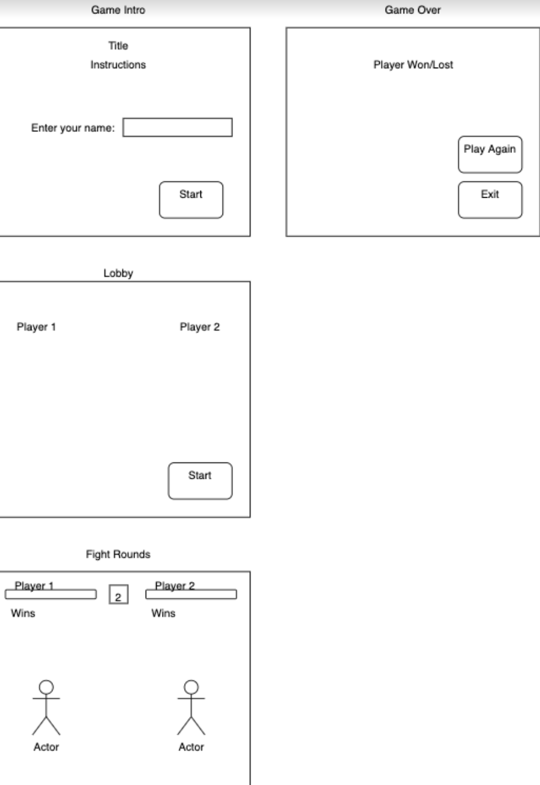
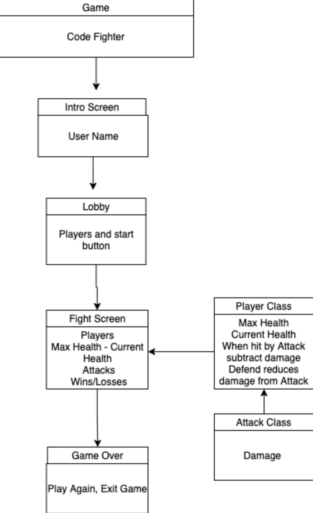

# CodeFighter

## Authors

Davee Sok | [LinkedIn](https://www.linkedin.com/in/davee-sok/) | [GitHub](https://github.com/daveeS987)

Glenn Clark | [LinkedIn](https://www.linkedin.com/in/glenn-elliron-clark/) | [GitHub](https://github.com/Elliron)

Kassie Bradshaw | [LinkedIn](https://www.linkedin.com/in/kassie-bradshaw-2021/) | [GitHub](https://github.com/kassiebradshaw)

Michael Ryan | [LinkedIn](https://www.linkedin.com/in/michaelanthonyryan/) | [GitHub](https://github.com/Michaelryan228)

Prabin Singh | [GitHub](https://github.com/prabin544)

---

## Links

- [Back End Server Repo](https://github.com/Team-Shrubbery/CodeFighter-Server)
- [Server URL](https://codefighter-server.herokuapp.com/)

---

## Project Organization

[Code Fighters Trello Board](https://trello.com/b/pkyCF5nn/python-arcade)

---

## Overview

CodeFighter is a "best 2-out-of-3" style fighting game where opponents will battle in a 3-round fight. Our vision is to create an entertaining multiplayer experience to allow users to battle online. It solves the pain point of ever-present boredom, and what better way than to play a game with someone else! Our product provides an opportunity for social interaction in a socially-distant world.

---

## Features

- Two players
- Can connect to an online server
- Communication is handled through python socketio.

---

## Tools & Dependencies

- Pygame
- Python Socket IO Client
- Pytest

---

## Wireframes

---

## Domain Modeling

---

## Getting Started

- Clone down this repo
- Install dependencies
- Cd into Game
- In command line run: `python main.py`

---

## How to Play

- Left and Right arrow keys to move
- Spacebar to jump
- Return to attack

---

## Credits

- [Pygame Fighter Tutorial](https://coderslegacy.com/python/pygame-rpg-game-tutorial/)
- [Character Sprite Sheets](http://maximoff.alreadyread.net/SpriteSheets/)
- [Program to find spritesheets](https://getspritexy.netlify.app/)
- [Pygame RPG Tutorial Code](https://www.youtube.com/channel/UChB6no22fVJ-6dGNTfbb05w)
- [Sockets](https://www.techwithtim.net/tutorials/python-online-game-tutorial/)
