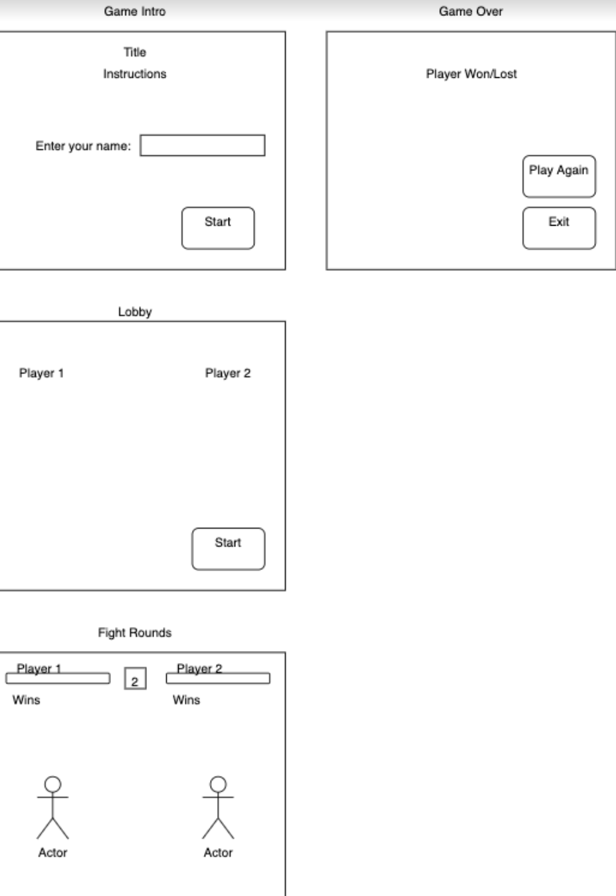
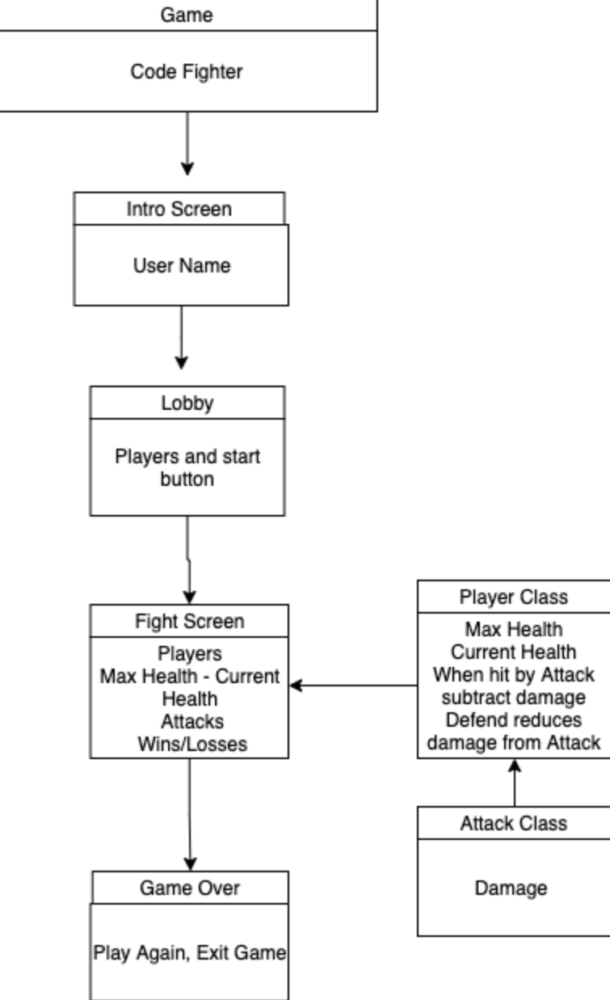

# CodeFighter

*Authors*:

Davee Sok | [LinkedIn](https://www.linkedin.com/in/davee-sok/) | [GitHub](https://github.com/daveeS987)

Glenn Clark | [LinkedIn](https://www.linkedin.com/in/glenn-elliron-clark/) | [GitHub](https://github.com/Elliron)

Kassie Bradshaw | [LinkedIn](https://www.linkedin.com/in/kassie-bradshaw-2021/) | [GitHub](https://github.com/kassiebradshaw)

Michael Ryan | [LinkedIn](https://www.linkedin.com/in/michaelanthonyryan/) | [GitHub](https://github.com/Michaelryan228)

Prabin Singh | [GitHub](https://github.com/prabin544)

## Project Organization

[Code Fighters Trello Board](https://trello.com/b/pkyCF5nn/python-arcade)

---

## Overview

CodeFighter is a "best 2-out-of-3" style fighting game where opponents will battle in a 3-round fight. Our vision is to create an entertaining multiplayer experience to allow users to battle online. It solves the pain point of ever-present boredom, and what better way than to play a game with someone else! Our product provides an opportunity for social interaction in a socially-distant world.

---

## Features

---

## Wireframes

---

## Domain Modeling

---

## Credits

[Pygame Fighter Tutorial](https://coderslegacy.com/python/pygame-rpg-game-tutorial/)

---

## Keyboard

- Left and Right arrow keys to move
- Spacebar to jump
- Return to attack

---